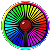
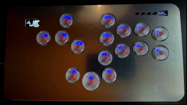
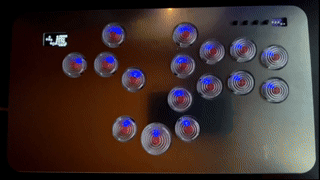
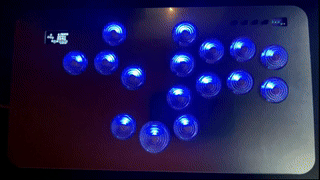

# Fight Lights Pico 
Fight Lights Pico is a versatile, customizable LED controller written in MicroPython for the Raspberry Pi Pico. It’s designed primarily for arcade stick modders who want to integrate dynamic RGB LED effects that respond to button presses or play smooth animations.

While built with arcade sticks in mind, the flexible design makes it suitable for a wide range of applications—from full-sized arcade cabinets to any DIY project that benefits from input-driven LED feedback.

# How does it look?
A short video showcasing some of the features to give an idea of the final look can be found here:

*Note: The video shows an early version of the project—many new features and improvements have been added since!*

You can also explore **community-made builds and setups** in the [Fight Lights Gallery](https://fight-lights.com/Gallery/gallery/), featuring creative builds.

## Requirement

To use **Fight Lights Pico**, you'll need the following:

### Hardware:
- **Raspberry Pi Pico** (or Raspberry Pi Pico 2)
- **RGB LEDs** (WS2812b/WS2812e)
- **Jumper wires** or other basic electronics components for wiring

### Software:
- **MicroPython** firmware installed on your Raspberry Pi Pico
  - You can download the latest version from [MicroPython's official site](https://micropython.org/download/rp2-pico/).
- **Thonny IDE** (or any other IDE that supports MicroPython)
  - Thonny can be downloaded from [thonny.org](https://thonny.org).
- **Fight Lights Pico** code (this repository)

# Guides

 A complete step by step guide for assembly and installation, with wiring Diagrams, soldering tips and customization options can be found here: https://docs.google.com/document/d/1qY4HESYdRyFT8OaB5leyHsWm4kfqoA74zqSLAdihuvo/edit?usp=sharing

It's important to note that Fight Lights Pico does not require a Brook fighting board. The code is designed to run standalone on the Raspberry Pi Pico. The Brook fighting board is used only as a means to transmit button signals to the Pico and to provide power for both the Pico and the LEDs. 

As long as the button signals can be sent to the Pico—whether directly or through a different PCB—and a power source is available for both the Pico and the LEDs, a Brook board is not necessary for operation.

## Contact

For any questions, feel free to join the **Discord server** where the community can assist:

https://discord.gg/9wSpNUprWT

[**Fight Lights Official Website**](https://fight-lights.com/)

## Features

- [**Configuration via User Interface**  
  Easily configure all settings through a straightforward UI.](https://fight-lights.com/configurator)

- **Custom RGB Colors on Button Press**  
  Choose any RGB color to light up LEDs when a button is pressed.

  

- **Flexible LED Assignment**  
  Assign any number of LEDs to activate on a button press.

  

- **Random Color Assignment**  
  Assign random colors to LEDs on button press for dynamic effects.

  

- **Simultaneous Button Color Matching**  
  Make multiple buttons light up with the same color when pressed simultaneously.

  

- **Fade-In and Fade-Out Effects**  
  Add smooth fade-in and fade-out transitions for your LED effects.

  

- **Not Pressed LED Color Options**  
  Choose any color (or none) for the LEDs when no buttons are pressed.

  

- **Rainbow Effect**  
  Select a colorful rainbow effect when buttons are not pressed.

  

- **Temporary Background Color Disable**  
  Disable background colors when a button is pressed for clearer focus.

  

- **Brightness Control**  
  Adjust brightness on bootup or during play for dynamic lighting.

  

- **Idle Mode with Custom Animations**  
  Set your LEDs to enter idle mode after a set time and display custom animations.

  

- **Custom Profiles**  
  Create multiple custom profiles and switch between them during gameplay.

  

- **Custom Animations on Input**  
  Add your own animations and trigger them based on specific button inputs.

- **8-Way Joystick support**  
  Recognize all 8 direction on a joystick indipendetly and assign color and LEDs.

- **Button Press and Usage Logging**  
  Keep track of button presses and the total time the arcade stick has been plugged in.

- **Player LED Support**  
  Support for player-specific LEDs for multiplayer setups.

- **OLED Display Support**  
  Compatible with OLED displays for additional information.

- **OLED Animation Support**  
  Add multi-frame animations on the OLED display for even more customization.

  

...and many more features to come!

